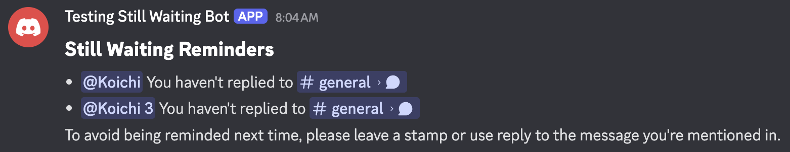

# Still Waiting Discord

Still Waiting Discord is a Discord bot that helps keep conversations active by reminding users to reply when they are mentioned but haven't responded or reacted within 24 hours. (You can customize this by self-hosting.) This ensures important messages don't get overlooked.

## Installation (Free)

1. Click [here](https://discord.com/oauth2/authorize?client_id=1379235275745656994&permissions=274877926400&integration_type=0&scope=bot) to add the bot to your server.
2. Mention someone in a message.
3. If they don’t leave a stamp or reply within 24 hours, the bot will remind them.
4. If you like this bot, feel free to share it using the link below:

`https://still-waiting.koichin.com/`

## Self-Hosting (Optional)

You can self-host this bot for more control and customization. This is completely optional and requires some basic knowledge of Python and .env files.

### Note

- **Never expose your Discord token or database credentials.** Always add your `.env` file to `.gitignore` and keep sensitive information private.
- You can self-host this bot for free using services with free tiers. (Render for hosting and Supabase for the database are both free at the time of writing.)
- You can test locally after setting up your Discord bot and database. However, do not share your bot publicly while running it locally. If you want to make changes after sharing, create a new bot application and token, and temporarily replace the token to prevent others from using your test bot.

### Steps

1. Star this repo.
2. Clone this repo.
3. Install requirements: `pip install -r requirements.txt` or use [`pyproject.toml`](pyproject.toml).
4. Create a `.env` file based on [`env.example`](env.example) in the root directory.
5. Set up a PostgreSQL database (Supabase is recommended) and update your `.env` file with the database credentials.
6. Create your Discord bot and add your bot token to the `.env` file:
    - Go to [Discord Developers](https://discord.com/developers/applications) and create a new application.
    - In the "Bot" tab, enable "PUBLIC BOT" if needed, reset the token, and copy it to your `.env` file.
    - In the "Bot" tab, enable all three intents: Presence, Server Members, and Message Content.
    - Reference: [Tech with Tim on YouTube](https://youtu.be/YD_N6Ffoojw?si=DHn1C2QrfDAwDw82&t=339)
7. Add your bot to your server:
    - Go to the "OAuth2" tab and scroll to "OAuth 2 URL Generator."
    - Select the "bot" scope and set the following permissions:
        - View Channels
        - Send Messages
        - Send Messages in Threads
        - Embed Links
    - Copy the generated URL and use it in your browser to add the bot to your server (the bot must be set to public to share with others).
    - Reference: [Tech with Tim on YouTube](https://youtu.be/YD_N6Ffoojw?si=0P-AwcLC3zhn_M3r&t=606)
8. Edit [`config.py`](src/config.py) to adjust any settings as needed.
9. Push the repository to a version control system (like GitHub) and deploy to a hosting service (Render is recommended).

## Contribution

This project is open-source under the [`MIT License`](LICENSE). Contributions are welcome! If you have ideas, suggestions, or improvements, feel free to open an issue or submit a pull request.

## Privacy

This bot does not store any message content. It only stores the following:

- For sending reminders:
  - IDs of mentioned users
  - IDs of the messages
  - IDs of the channels
  - Timestamps of the messages received
After sending a reminder, this data is deleted automatically.

- For project statistics:
  - The number of servers the bot is in
  - The number of users who have used the bot
  - The number of messages processed by the bot
This data is stored permanently and may be used to publicly share bot usage statistics, but it does not include any personal information or message content.

## Disclaimer

This bot is provided as-is with no guarantees. Use at your own risk. The author and any contributors are not responsible for any issues that arise from using this bot.
